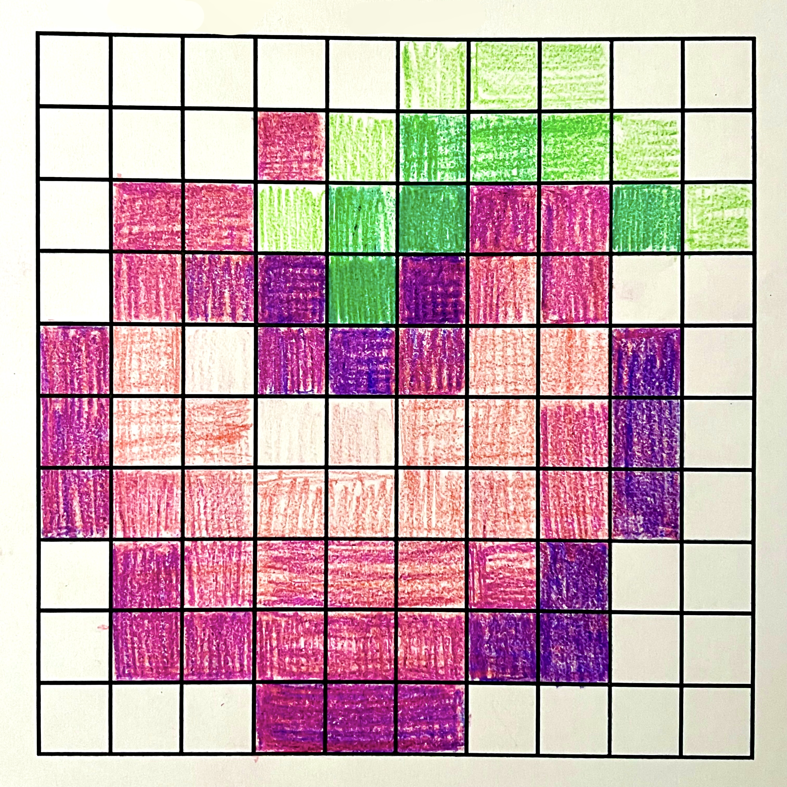
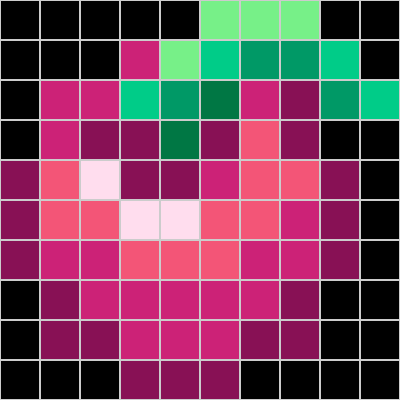

# Colors

This was to learn about how images are stored as binary, and that it's
more convenient to think of them in terms of hexadecimal.

I chose to draw a generic pinkish berry.


## The Orignial Drawing




## The Binary Recreation

The work for this section was done with [code.org](https://studio.code.org/courses/pixelation/units/1/lessons/5/levels/1)...



...using this binary:

```
0000 1010
0000 1010
0001 1000
000000000000000000000000 000000000000000000000000 000000000000000000000000 000000000000000000000000 000000000000000000000000 011101111111000010001000 011101111111000010001000 011101111111000010001000 000000000000000000000000 000000000000000000000000 
000000000000000000000000 000000000000000000000000 000000000000000000000000 110011000010001001110111 011101111111000010001000 000000001100110010001000 000000001001100101100110 000000001001100101100110 000000001100110010001000 000000000000000000000000 
000000000000000000000000 110011000010001001110111 110011000010001001110111 000000001100110010001000 000000001001100101100110 000000000111011101000100 110011000010001001110111 100010000001000101010101 000000001001100101100110 000000001100110010001000 
000000000000000000000000 110011000010001001110111 100010000001000101010101 100010000001000101010101 000000000111011101000100 100010000001000101010101 111100110101010101110111 100010000001000101010101 000000000000000000000000 000000000000000000000000 
100010000001000101010101 111100110101010101110111 111111111101110111101110 100010000001000101010101 100010000001000101010101 110011000010001001110111 111100110101010101110111 111100110101010101110111 100010000001000101010101 000000000000000000000000 
100010000001000101010101 111100110101010101110111 111100110101010101110111 111111111101110111101110 111111111101110111101110 111100110101010101110111 111100110101010101110111 110011000010001001110111 100010000001000101010101 000000000000000000000000 
100010000001000101010101 110011000010001001110111 110011000010001001110111 111100110101010101110111 111100110101010101110111 111100110101010101110111 110011000010001001110111 110011000010001001110111 100010000001000101010101 000000000000000000000000 
000000000000000000000000 100010000001000101010101 110011000010001001110111 110011000010001001110111 110011000010001001110111 110011000010001001110111 110011000010001001110111 100010000001000101010101 000000000000000000000000 000000000000000000000000 
000000000000000000000000 100010000001000101010101 100010000001000101010101 110011000010001001110111 110011000010001001110111 110011000010001001110111 100010000001000101010101 100010000001000101010101 000000000000000000000000 000000000000000000000000 
000000000000000000000000 000000000000000000000000 000000000000000000000000 100010000001000101010101 100010000001000101010101 100010000001000101010101 000000000000000000000000 000000000000000000000000 000000000000000000000000 000000000000000000000000 
```

...and this hexadecimal:

```
0A
0A
18
000000 000000 000000 000000 000000 77F088 77F088 77F088 000000 000000 
000000 000000 000000 CC2277 77F088 00CC88 009966 009966 00CC88 000000 
000000 CC2277 CC2277 00CC88 009966 007744 CC2277 881155 009966 00CC88 
000000 CC2277 881155 881155 007744 881155 F35577 881155 000000 000000 
881155 F35577 FFDDEE 881155 881155 CC2277 F35577 F35577 881155 000000 
881155 F35577 F35577 FFDDEE FFDDEE F35577 F35577 CC2277 881155 000000 
881155 CC2277 CC2277 F35577 F35577 F35577 CC2277 CC2277 881155 000000 
000000 881155 CC2277 CC2277 CC2277 CC2277 CC2277 881155 000000 000000 
000000 881155 881155 CC2277 CC2277 CC2277 881155 881155 000000 000000 
000000 000000 000000 881155 881155 881155 000000 000000 000000 000000 
```

---

Written on Oct. 30, 2025.
