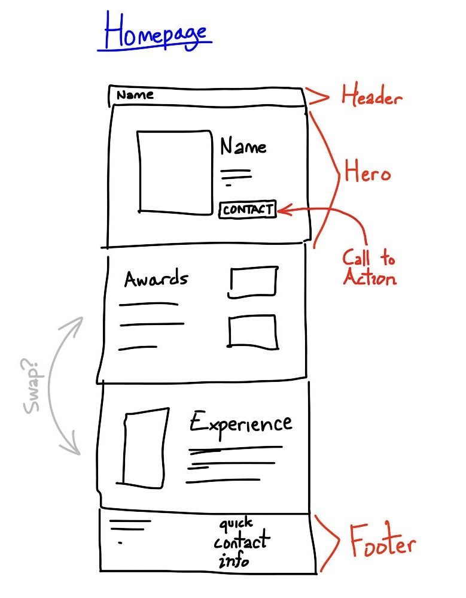
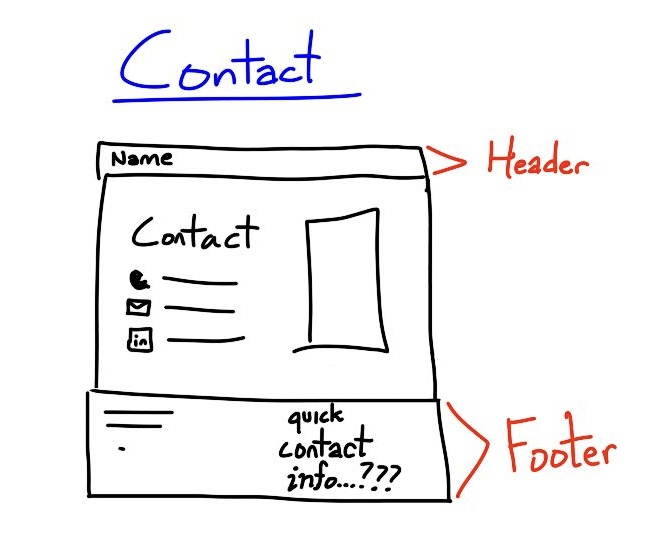

# The Project Process

For the listeners back home, this is my final project for ITD 110.

## Initial Mockup

The color scheme was described as "professional," consisting of white, black, dark blue, and gray.

Mockup drawings from Jan. 21:

## First Check-In

Jan. 24, over text;

For this check-in, I showed a basic layout idea of what the main page may look like. Most feedback was regarding the visuals. My client suggested that I switch to a dark theme, add more visual flair, or even add transition effects. He reiterated that the design should look professional and sleek.

I decided to shelf the special effects for later on, if time permits. As for the visuals, I changed everything to a darker style and added a new font (previously, it had just been the browser's default font).

## Second Check-In

Jan. 25, over text;

I showed my new and improved visuals, now with a dark theme, and the client seemed to like it. At this point, I had a somewhat detailed version of what both the main page and the Experience pages would look like.

I continued to work on the Experience page, and then made a Resume page. Every planned page now has a decent skeleton.

## Third Check-In

Jan. 26, over text;

Since the last check-in, I had been fleshing out the existing pages and doing some reorganizing/redesigning. Upon seeing my work, my client said it looked good.(!!!) He suggested that I change his portrait photo to a different one, and sent the new photo to me. Then, he debated changing some text colors but decided against that in the end.

Following his feedback, I added the alternate photo to the site.

## Fourth Check-In

Jan. 27, over text;

Once my client saw the new photo in action, he decided to revert it back to the original one. Additionally, he asked me to add links to his YouTube and GitHub account, and to change the accent color to yellow-white to better match the photo.

I quickly changed the photo back, and then added links (in button form) to his socials at the bottom of every page.

## Code Transfer Plans

The code will be transferred to my client's GitHub account sometime in the not-so-distant future. There, the content will be added.
I think I'll copy the project files (excluding process.md and such) into a new repository and go from there.