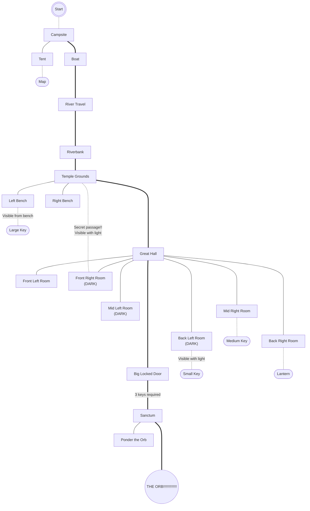

# The ORB

## Story & Setting

The goal of the game is to find and steal THE ORB!!!, and then flee back to your campsite before the CURSE OF THE ORB!!! takes its revenge.

This story is set in a foresty area (jungle, perhaps? or is that too on-the-nose?). Somewhere in this forest is the grand temple which houses THE ORB!!!. You must navigate the river to reach the temple, then search for the keys to the temple's inner sanctum where THE ORB!!! is waiting. Since THE ORB!!! just has to be cursed, you must escape back to your campsite within a certain amount of turns or else the CURSE OF THE ORB!!! will consume you.

## Map

This miiight have to be cut down depending on how hard it is to make this 😳😔 Just maybe



See bottom for river map(s)

### Map Details:
- You cannot start your journey without the mapping supplies
- You cannot inspect a DARK room without the LANTERN
- Once you recieve THE ORB!!! and so also the CURSE OF THE ORB!!!, the main temple door will close. You will have to get back out using the secret passage.
- Whatever the physical manefestation of the CURSE OF THE ORB!!! is will chase you down; you will lose the game if you cannot make it back to the Campsite in a certain number of turns

## Required Global Variables

All are booleans except for `remainingTurnsToEscape`, a number.

- `hasMap`
- `hasSmallKey`
- `hasMediumKey`
- `hasLargeKey`
- `hasLantern`
- `hasDiscoveredSecretPass`
- `hasCurseOfTheOrb`
- `remainingTurnsToEscape`


## River Map Storage

```
Original 
+----------------------------------------------------------------------------------+
|                                                                                  |
|                                            --.__                                 |
|                                                 ^^-.     __.._                   |
|                                                     \_.^      \.__               |
|                 _.---.__                             /            ^--.__ Temple  |
|                         \                          ./                            |
|                         /___.....__           __.-^                              |      
|                    _.--^           ^--..__..--                                   |
|                  ./                      \.              _..----..               |
|                ./                          \           _/                        |
|  Camp ___..---=_                            ^._____..-^                          |
|                 ^\__                              \.__                           |
|                     ^---                                                         |
|                                                                                  |
+----------------------------------------------------------------------------------+

Segments Labeled 
(this is how their location functions are named, and how they're colored) 
+----------------------------------------------------------------------------------+
|                                                                                  |
|                                            --.__ H                               |
|                                                 ^^-.     __.._                   |
|                                                     \_.^      \.__ I             |
|                 _.---.__ D                           /            ^--.__ Temple  |
|                         \                          ./                            |
|                         /___.....__           __.-^ G                            |      
|                    _.--^         E ^--..__..--             J                     |
|                  ./ L                    \.              _..----..               |
|          A     ./                          \           _/                        |
|  Camp ___..---=_                            ^._____..-^                          |
|                 ^\__                        F     \.__                           |
|                 B   ^---                             K                           |
|                                                                                  |
+----------------------------------------------------------------------------------+

Backslashed
+----------------------------------------------------------------------------------+
|                                                                                  |
|                                            --.__                                 |
|                                                 ^^-.     __.._                   |
|                                                     \\_.^      \\.__               |
|                 _.---.__                             /            ^--.__ Temple  |
|                         \\                          ./                            |
|                         /___.....__           __.-^                              |      
|                    _.--^           ^--..__..--                                   |
|                  ./                      \\.              _..----..               |
|                ./                          \\           _/                        |
|  Camp ___..---=_                            ^._____..-^                          |
|                 ^\\__                              \\.__                           |
|                     ^---                                                         |
|                                                                                  |
+----------------------------------------------------------------------------------+

Color Coding!?
ABDEF... = start, x = end
X = start for labels
C is skipped because Camp
All these letters will be replaced with span tags
+----------------------------------------------------------------------------------+
|    |                                                                             |
|  ——O——                                     H--.__x                                 |
|    |                                            H^^-.x     I__.._x                   |
|                                                     H\\_xI.^      \\.__x               |
|                 D_.---.__x                             G/x            I^--.__x XTemplex  |
|                         D\\x                          G./x                            |
|                         D/xE___.....__x           G__.-^x                              |      
|                    L_.--^x           E^--.._xG_..--x                                   |
|                  L./x                      F\\.x              J_..----..x               |
|                L./x                          F\\x           J_/x                        |
|  XCampx A___..---=xB_x                            F^.____xJ_..-^x                          |
|                 B^\\__x                              K\\.__x                           |
|                     B^---x                                                         |
|                                                                                  |
+----------------------------------------------------------------------------------+
```